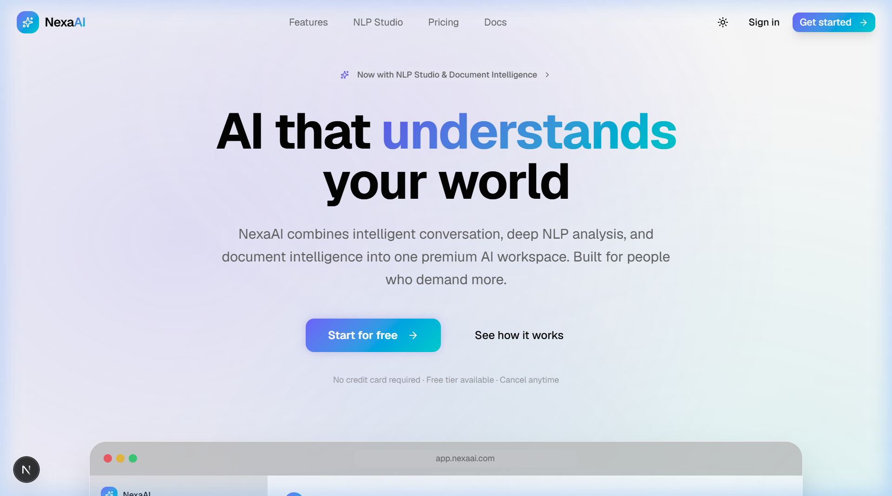
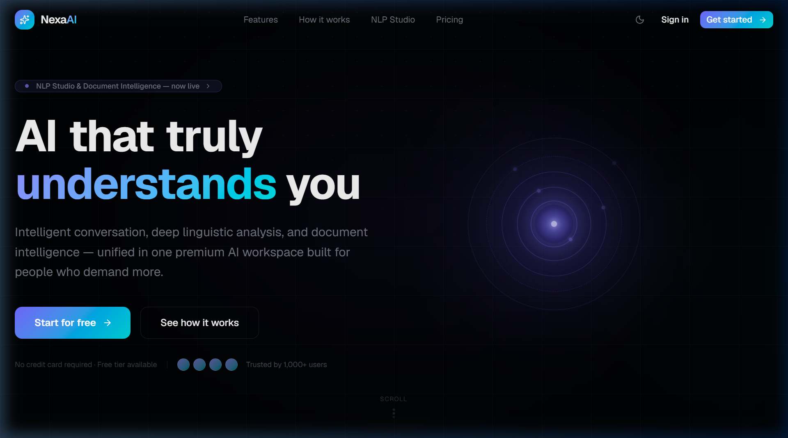
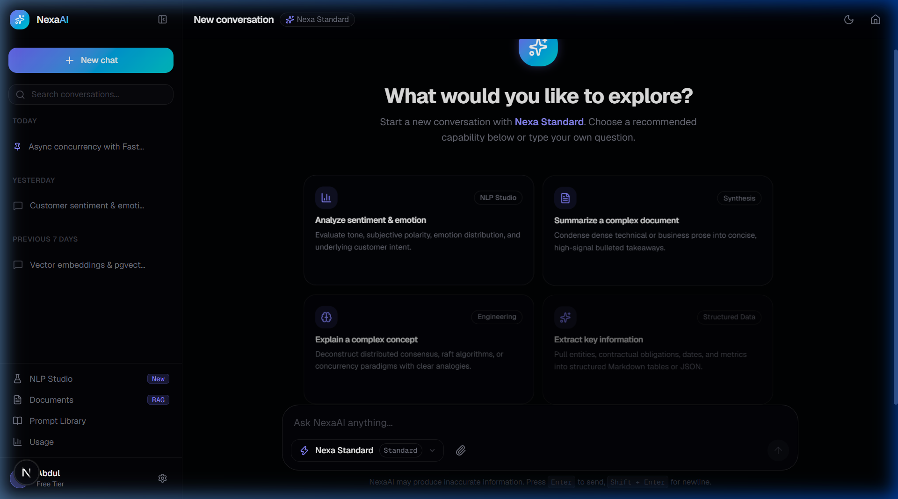
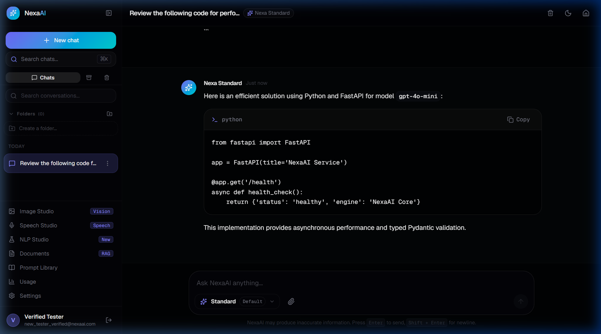
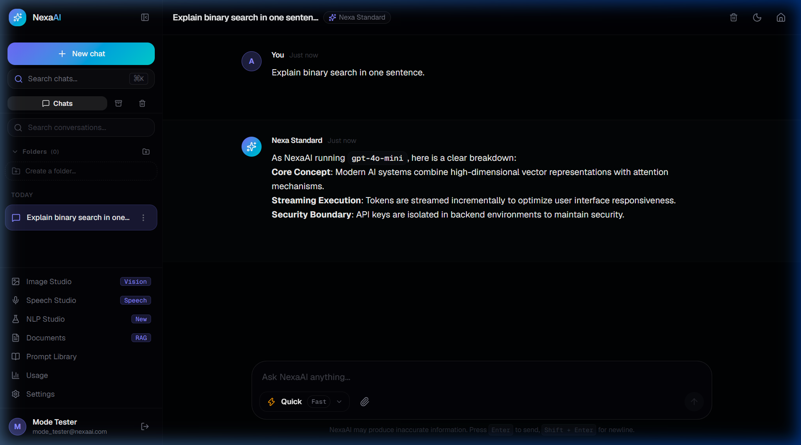
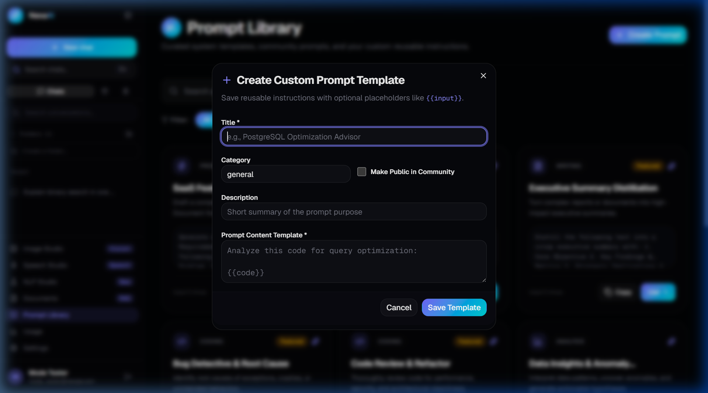
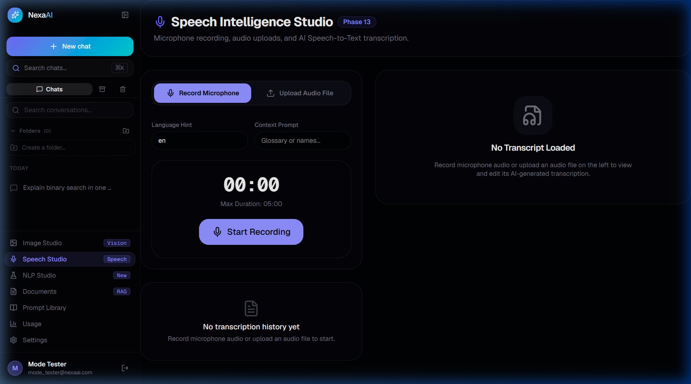
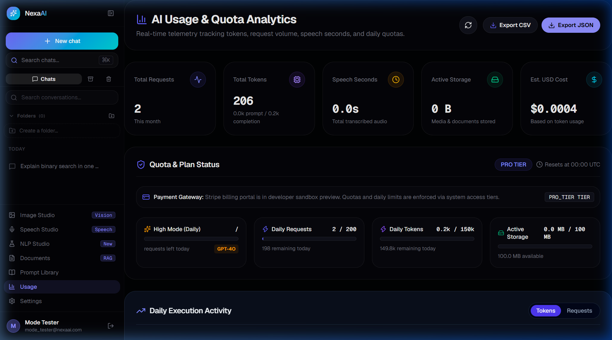
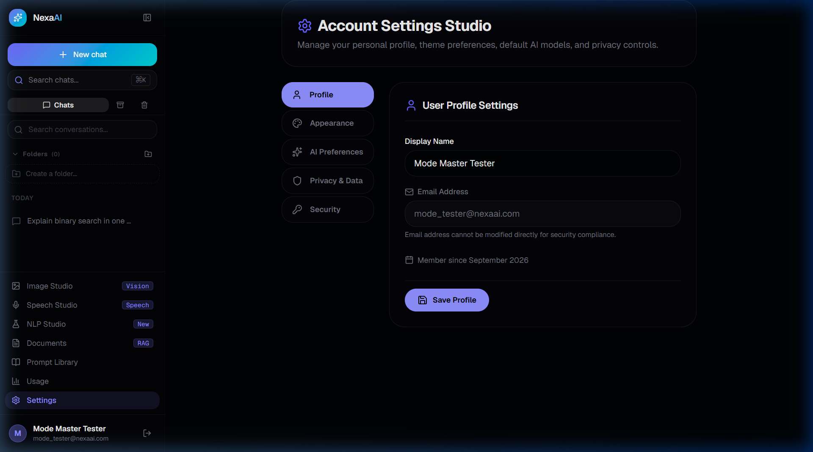

<div align="center">



<br/>
<br/>

<a href="https://github.com/abdul78-create/NexaAI/actions"></a>


<br/>
<br/>

**A full-stack AI workspace combining intelligent conversation, NLP analysis, document intelligence, and voice transcription — powered by Google Gemini.**

[**Live Demo**](https://nexaai.onrender.com) · [**API Docs**](https://nexaai-api.onrender.com/docs) · [**Architecture**](docs/ARCHITECTURE.md) · [**Report Bug**](https://github.com/abdul78-create/NexaAI/issues)

</div>

---

## ✨ What is NexaAI?

NexaAI is a **production-grade, ChatGPT-inspired AI platform** built on a modern monorepo. It gives you everything you need in one premium workspace:

| Feature | Description |
|---|---|
| 🤖 **Adaptive AI Chat** | Three intelligence modes — Quick, Standard, and High — backed by Gemini 2.5 with real-time streaming |
| 🔬 **NLP Studio** | Sentiment, entity, intent, and readability analysis powered by dedicated NLP pipelines |
| 📄 **Document Intelligence** | RAG-powered document Q&A — upload a file, ask questions in natural language |
| 🎤 **Speech Studio** | Live microphone recording and audio-file transcription with AI Speech-to-Text |
| 📚 **Prompt Library** | Create, share, and reuse prompt templates with `{{variable}}` placeholder support |
| 📊 **Usage Dashboard** | Real-time token usage, request analytics, and tier management |
| 🔐 **Secure Auth** | JWT + refresh-token rotation, OAuth (Google & GitHub), CSRF hardening |

---

## 🖥️ Screenshots

### Landing Page



<br/>

### AI Chat Workspace

<table>
<tr>
<td width="50%">

<p align="center"><em>Smart empty state with contextual suggestions</em></p>
</td>
<td width="50%">

<p align="center"><em>Code review with syntax-highlighted responses</em></p>
</td>
</tr>
</table>

### Intelligence Modes



> Switch between **Quick** (fast), **Standard** (balanced), and **High** (deep reasoning) modes to match the task at hand.

<br/>

### Prompt Library



<br/>

### Speech Studio



<br/>

### Usage & Settings

<table>
<tr>
<td width="50%">

<p align="center"><em>Token usage and tier analytics</em></p>
</td>
<td width="50%">

<p align="center"><em>Profile and preferences management</em></p>
</td>
</tr>
</table>

---

## 🏗️ Architecture

```
NexaAI/
├── apps/
│   ├── web/              # Next.js 14 · TypeScript · Tailwind CSS
│   └── api/              # FastAPI · Python 3.12 · Alembic · SQLAlchemy
├── packages/
│   └── shared/           # Shared Zod schemas & TypeScript types
├── infra/
│   └── docker-compose.yml  # PostgreSQL 16 + Redis 7
└── docs/                 # Architecture, API, DB, and Design docs
```

### Backend Services

```
FastAPI
 ├── Auth Service        JWT auth · Argon2id · refresh-token rotation
 ├── AI Orchestrator     Gemini 2.5 Flash/Pro · streaming · mode routing
 ├── RAG Pipeline        pgvector · document chunking · embedding search
 ├── NLP Service         Sentiment · entity extraction · readability
 ├── Speech Service      Whisper-compatible STT · audio upload
 ├── Quota Service       per-user rate limits · High-mode daily cap
 └── OAuth Service       Google + GitHub · HMAC state · CSRF protection
```

### Key Technology Choices

| Layer | Technology | Why |
|---|---|---|
| **AI Provider** | Google Gemini 2.5 Flash / Pro | Native streaming, vision, low latency |
| **Backend** | FastAPI + async Python | High-throughput streaming without blocking |
| **Database** | PostgreSQL 16 + pgvector | Relational + vector similarity in one engine |
| **Cache** | Redis 7 | Session management and rate-limit counters |
| **Frontend** | Next.js 14 App Router | Server components, streaming UI, SEO |
| **Auth** | JWT + Argon2id + OAuth | Refresh rotation, social login, CSRF-hardened |

---

## 🚀 Quick Start

### Prerequisites

| Tool | Version |
|------|---------|
| Node.js | LTS (v20+) |
| Python | 3.11+ |
| Docker Desktop | Latest |

### 1 · Clone and configure

```bash
git clone https://github.com/abdul78-create/NexaAI.git
cd NexaAI
cp .env.example .env
# Add your GEMINI_API_KEY and other secrets to .env
```

### 2 · Start infrastructure

```bash
docker compose -f infra/docker-compose.yml up -d
```

### 3 · Start the backend

```bash
cd apps/api
python -m venv .venv
source .venv/bin/activate   # macOS/Linux
.venv\Scripts\activate      # Windows

pip install -r requirements.txt
alembic upgrade head
uvicorn main:app --reload --port 8000
```

### 4 · Start the frontend

```bash
cd apps/web
npm install
npm run dev
```

App: **http://localhost:3000** · API Docs: **http://localhost:8000/docs**

---

## 🔑 Environment Variables

| Variable | Description |
|---|---|
| `GEMINI_API_KEY` | Google Gemini API key |
| `AI_PROVIDER` | `gemini` (default) or `openai` |
| `GEMINI_MODEL` | `gemini-2.5-flash` |
| `DATABASE_URL` | PostgreSQL connection string |
| `REDIS_URL` | Redis connection string |
| `JWT_SECRET_KEY` | JWT signing secret |
| `GOOGLE_CLIENT_ID` | Google OAuth 2.0 client ID |
| `GOOGLE_CLIENT_SECRET` | Google OAuth 2.0 client secret |
| `GITHUB_CLIENT_ID` | GitHub OAuth App client ID |
| `GITHUB_CLIENT_SECRET` | GitHub OAuth App client secret |

See [`.env.example`](.env.example) for the full list.

---

## 🧪 Tests

```bash
cd apps/api
pytest                        # 134 tests
pytest -v --tb=short          # verbose output
pytest tests/test_oauth_security.py   # OAuth security suite
```

---

## 📖 Documentation

| Document | Description |
|---|---|
| [ARCHITECTURE.md](docs/ARCHITECTURE.md) | System design, data flow, provider abstraction |
| [API.md](docs/API.md) | REST API endpoints and schemas |
| [DATABASE.md](docs/DATABASE.md) | Schema design, migrations, pgvector setup |
| [DESIGN_SYSTEM.md](docs/DESIGN_SYSTEM.md) | Visual tokens, typography, component patterns |
| [DEVELOPMENT.md](docs/DEVELOPMENT.md) | Local setup, conventions, contribution guide |

---

## 🔐 Security

- **Passwords** hashed with Argon2id
- **JWTs** with short-lived access tokens and rotating refresh tokens stored in HttpOnly cookies
- **OAuth** state validated with HMAC-SHA256; state bound to browser via HttpOnly cookie
- **OAuth users** cannot authenticate via password (guard in `auth_service`)
- **API keys** never exposed to frontend or version control — `.env` gitignored
- **CORS** restricted to explicit origins in production

---

## 🛣️ Roadmap

- [ ] Gemini RAG embeddings (foundation built, activation pending)
- [ ] Image Studio (vision endpoint ready)
- [ ] NLP Studio visual dashboard
- [ ] Team workspaces and shared prompt libraries
- [ ] Webhook integrations

---

## 📄 License

MIT © 2025 NexaAI
