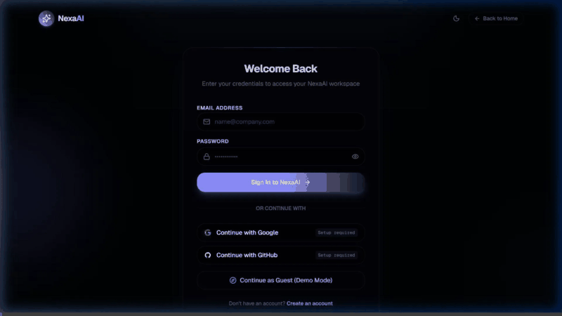

<div align="center">


# NexaAI

**Full-stack AI workspace integrating multi-modal chat, NLP text analysis, document intelligence, and voice transcription — powered by Google Gemini.**

<p align="center">
  <a href="https://github.com/abdul78-create/NexaAI/actions"></a>
  
  
  
  
  
  
</p>

[**🌐 Live Application**](https://nexaai-frontend-lgzs.onrender.com) · [**📚 Interactive API Docs**](https://nexaai.onrender.com/docs) · [**🏗️ Architecture Spec**](docs/ARCHITECTURE.md)

</div>

---

## 🎬 Live Product Walkthrough

<div align="center">
  
  <p><em>Real-time walkthrough: multi-mode AI chat, prompt studio, speech transcription, and usage telemetry.</em></p>
</div>

---

## ⚡ Core Capabilities

- **Adaptive Intelligence Modes** — Dynamically route requests between **Quick** (instant completions), **Standard** (balanced Gemini 2.5 Flash), and **High** (deep reasoning Gemini 2.5 Pro with daily tier quotas).
- **Streaming Execution** — Low-latency Server-Sent Events (SSE) token streaming with robust error boundaries and markdown code highlighting.
- **Speech Intelligence Studio** — In-browser microphone recording and audio file transcription with multilingual speech-to-text.
- **Reusable Prompt Library** — Template system supporting dynamic `{{variable}}` substitution, community sharing, and instant insertion into chat.
- **Enterprise-Grade Auth** — Dual-layer authentication featuring JWT with rotating refresh tokens, Argon2id hashing, and hardened OAuth (Google & GitHub) with HMAC-SHA256 CSRF protection.
- **Document Intelligence & RAG** — pgvector semantic search foundation for contextual retrieval and document question-answering.

---

## 🖼️ Feature Showcase

<table>
  <tr>
    <td width="50%">
      
      <h4 align="center">Streaming Code Review & Synthesis</h4>
    </td>
    <td width="50%">
      
      <h4 align="center">Quick · Standard · High Mode Routing</h4>
    </td>
  </tr>
  <tr>
    <td width="50%">
      
      <h4 align="center">Prompt Engineering & Variable Templates</h4>
    </td>
    <td width="50%">
      
      <h4 align="center">Live Audio & Voice Intelligence</h4>
    </td>
  </tr>
</table>

---

## 🏛️ System Architecture

```
                                    ┌───────────────────────┐
                                    │    Next.js 14 Web     │
                                    │  (Tailwind + Zustand) │
                                    └──────────┬────────────┘
                                               │ HTTP / SSE / OAuth
                                               ▼
                                    ┌───────────────────────┐
                                    │    FastAPI Gateway    │
                                    └──────────┬────────────┘
               ┌───────────────────────────────┼───────────────────────────────┐
               ▼                               ▼                               ▼
    ┌──────────────────────┐        ┌──────────────────────┐        ┌──────────────────────┐
    │    AI Orchestrator   │        │     Auth Service     │        │     Storage Layer    │
    │  - Gemini 2.5 Flash  │        │  - JWT Rotation      │        │  - PostgreSQL 16     │
    │  - Gemini 2.5 Pro    │        │  - Google / GitHub   │        │  - pgvector          │
    │  - Mode Router       │        │  - HMAC CSRF State   │        │  - Redis 7 Caching   │
    └──────────────────────┘        └──────────────────────┘        └──────────────────────┘
```

### Technology Matrix

| Layer | Primary Tech | Architectural Rationale |
|---|---|---|
| **AI Inference** | Google Gemini 2.5 (`flash` / `pro`) | Native multi-modal streaming, high throughput, deep context |
| **Backend** | FastAPI + Python 3.12 (AsyncIO) | Asynchronous non-blocking I/O for concurrent token streams |
| **Relational & Vector** | PostgreSQL 16 + pgvector | Unified persistence for users, chats, prompts, and vector embeddings |
| **Session & Rate Limit** | Redis 7 | Distributed cache for token blacklisting, quotas, and sessions |
| **Frontend** | Next.js 14 + Tailwind CSS | Hybrid rendering, responsive design system, optimistic UI states |
| **Authentication** | Argon2id + HMAC-SHA256 OAuth | Defense-in-depth credential security and state tampering protection |

---

## 🚀 Quickstart

### Prerequisites
- **Node.js**: v20+ LTS
- **Python**: 3.11+
- **Docker**: Engine & Docker Compose

### 1. Clone & Environment Configuration
```bash
git clone https://github.com/abdul78-create/NexaAI.git
cd NexaAI
cp .env.example .env
```

Configure your environment keys in `.env` (including `GEMINI_API_KEY`, `SECRET_KEY`, and optional OAuth credentials).

### 2. Launch Local Database & Cache
```bash
docker compose -f infra/docker-compose.yml up -d
```

### 3. Run Backend & Frontend
```bash
# Terminal 1 — Backend API
cd apps/api
python -m venv .venv && source .venv/bin/activate   # On Windows: .venv\Scripts\activate
pip install -r requirements.txt
alembic upgrade head
uvicorn main:app --reload --port 8000

# Terminal 2 — Web Application
cd apps/web
npm install
npm run dev
```

Visit [**http://localhost:3000**](http://localhost:3000) to access the workspace. Swagger documentation is available at [**http://localhost:8000/docs**](http://localhost:8000/docs).

---

## 🧪 Test Suite

The backend includes comprehensive test coverage across authentication, AI orchestration, streaming, mode routing, and OAuth security:

```bash
cd apps/api
pytest -v --tb=short
```

```
============================== 134 passed in 4.82s ==============================
```

---

## 🔒 Security Baseline

- **OAuth Hardening**: State parameters generated via cryptographically signed `HMAC-SHA256(provider, nonce, timestamp)` bound to HttpOnly, SameSite cookies.
- **Provider Account Protection**: Passwords are strictly prohibited for OAuth-linked accounts; profile linking requires verified provider emails.
- **Token Hygiene**: Short-lived JWT access tokens paired with rotating refresh tokens; client secrets never exposed to frontend bundles.
- **Strict CORS**: Explicit origin whitelisting configured for production microservices.

---

## 📜 License

Distributed under the MIT License. See [`LICENSE`](LICENSE) for details.
